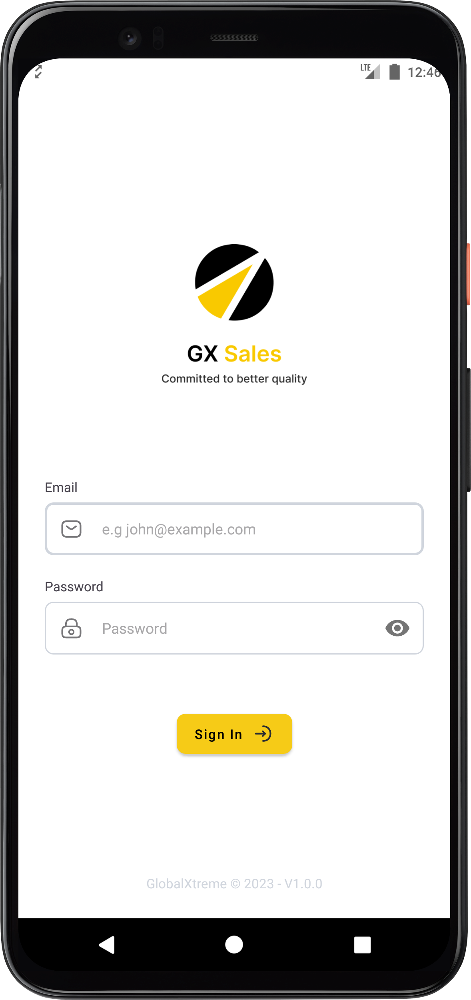
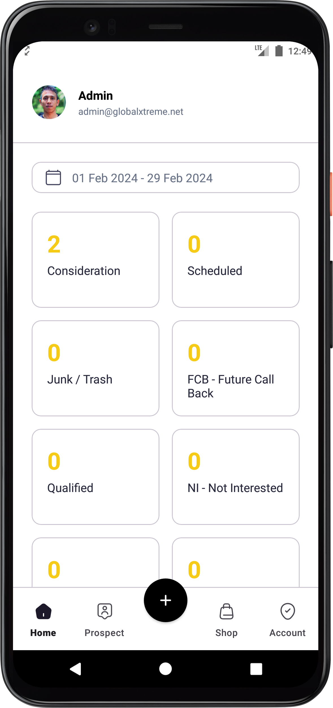
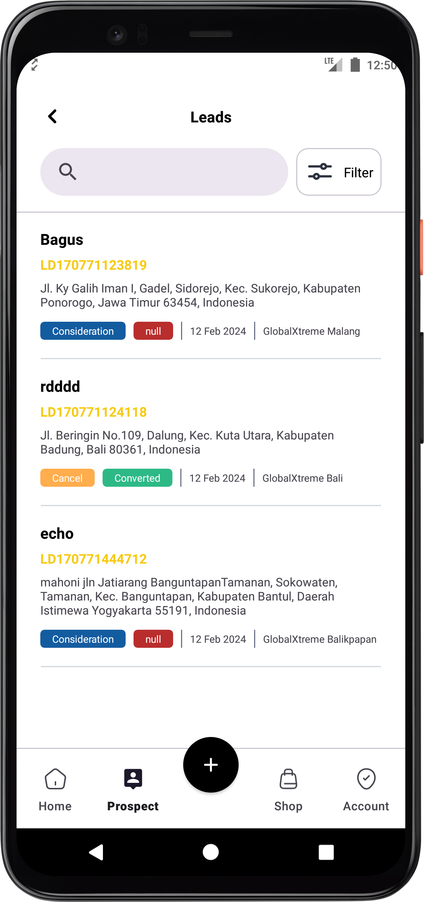
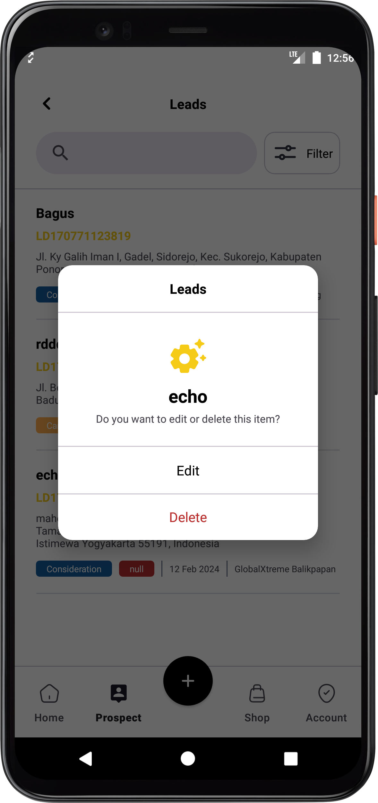
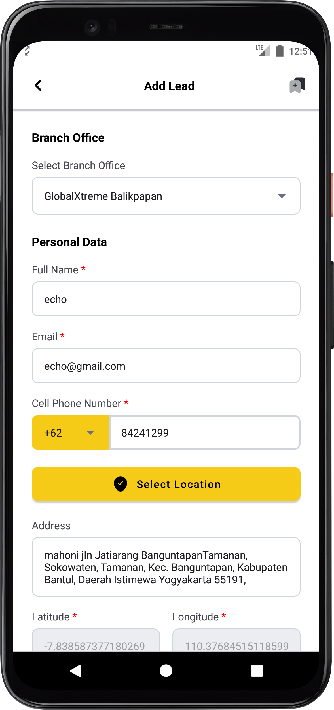
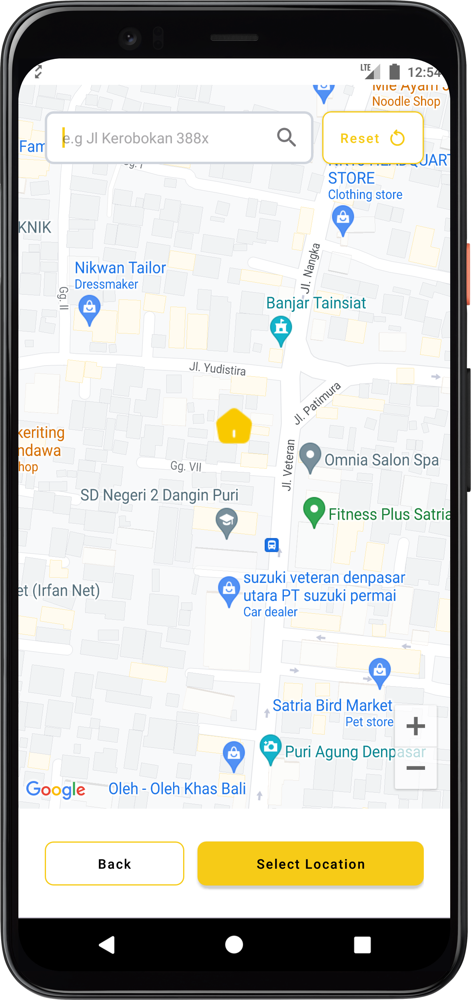
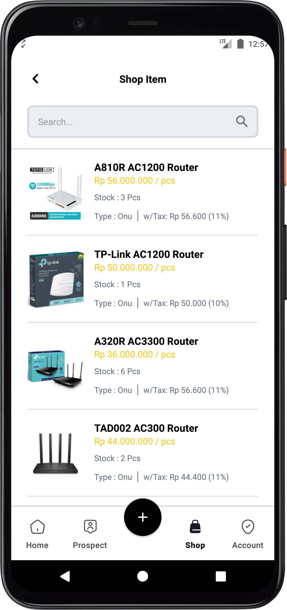
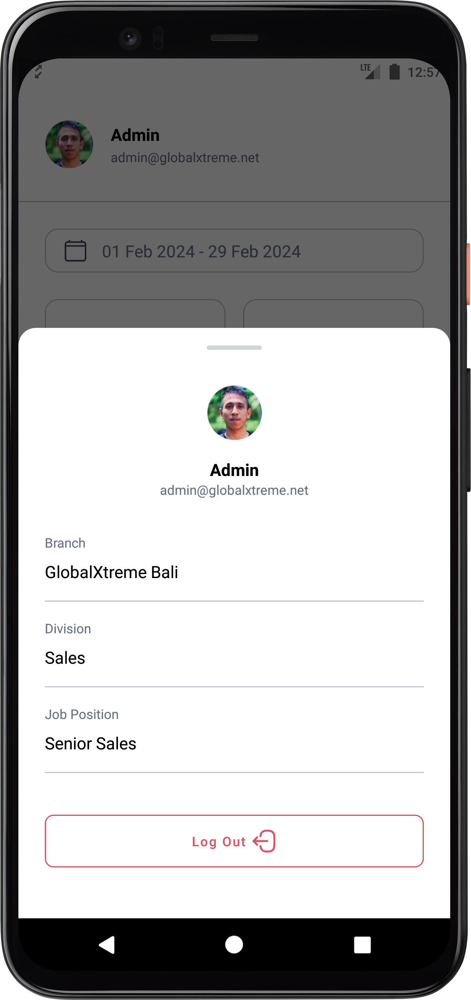

### Libraries & Stack

All the libraries that used to build this project:
* MVVM (Model View ViewModel)
* Material [Design](https://m3.material.io/)
* API Client [Retrofit](https://square.github.io/retrofit/)
* Local Storage [Shared Preferences](https://developer.android.com/jetpack/androidx/releases/room)
* Navigation [Component](https://developer.android.com/guide/navigation)
* Dependency Injection [Koin](https://insert-koin.io/)
* Logging Interceptor [Chucker Interceptor](https://github.com/ChuckerTeam/chucker)
* Image Loader [Coil](https://coil-kt.github.io/coil/)
* MAP [Google Maps API](https://developers.google.com/maps/documentation)
* Easy [Permission](https://github.com/vmadalin/easypermissions-ktx)

### Screenshoot

   
  
 